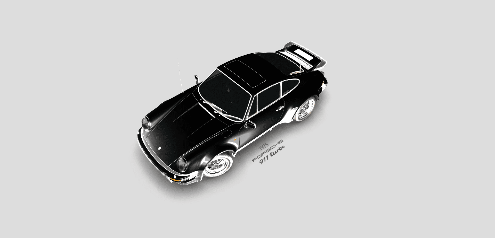

Porsche 911 930 Turbo 1975 3D Model: Timeless Elegance in Three.js
==================================================================  

[Live Website](https://utkarshpathrabe.github.io/Porche-911-930-Turbo-1975-3D-Model/)  

The Porsche 911 930 Turbo 1975 3D Model is a testament to craftsmanship and technology, brought to life through the artistry of Three.js. This digital masterpiece meticulously recreates the iconic Porsche 911, capturing every curve, contour and detail of the 1975 Turbo model.

## Key Features:

* *Precision Detailing*: The model faithfully replicates the car's exterior and interior, showcasing every element with exceptional accuracy.  

* *Realistic Textures*: The model boasts realistic textures that make it nearly indistinguishable from the actual car, highlighting the timeless design.  

* *Interactivity*: Users can interact with the model, zooming in for close-ups, exploring from various angles and appreciating the car's design in fine detail.  

* *Historical Authenticity*: The 3D model is a tribute to historical accuracy, preserving the essence of a classic automobile.  

The Porsche 911 930 Turbo 1975 3D Model is more than just a digital representation; it's a work of art that pays homage to automotive history. Whether you're an automotive enthusiast, a designer or simply an admirer of classic cars, this model offers a captivating and immersive experience that allows you to explore the timeless beauty of the Porsche 911 Turbo from 1975 in unprecedented detail.  

